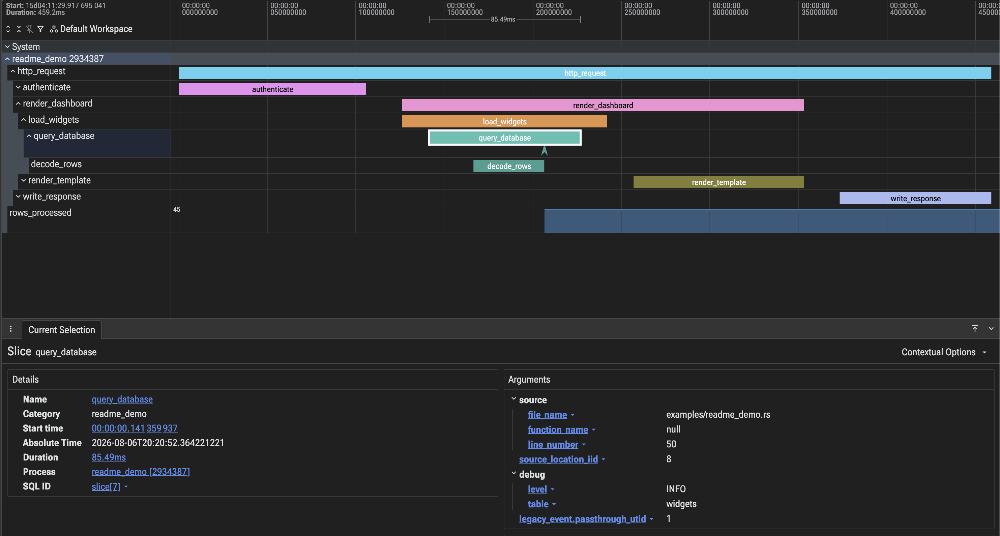

<!-- Copyright 2026 Lalit Maganti -->
<!-- SPDX-License-Identifier: Apache-2.0 -->

# tracing-perfetto-file

A low-overhead, low-dependency Rust crate for use with the [`tracing`](https://docs.rs/tracing)
ecosystem which outputs a [Perfetto](https://perfetto.dev) protobuf trace file for
visualization in the [UI](https://ui.perfetto.dev). It directly streams events to a file
without an SDK or any external daemons.



Open generated `.pftrace` files in [Perfetto UI](https://ui.perfetto.dev), or analyze them
programmatically with the [Trace Processor](https://perfetto.dev/docs/analysis/trace-processor-python)
Python bindings.

## Why use this crate?

There are _lots_ of other `tracing` crates out there, outputting both the Perfetto format
and other comparable formats. So why choose this one?

Compared to other crates, it:

- works with native `tracing` instrumentation and does not require you to change how you
  instrument your code.
- is _highly_ performant while still conforming to the `tracing-subscriber` layer API.
- has few dependencies and does not require a heavyweight SDK, generated protobuf code, or an
  external capture process.
- preserves complete span lifetimes when spans move between threads or close on a different
  thread.
- respects parent-child relationships by emitting explicitly parented Perfetto tracks instead
  of relying on same-thread BEGIN/END nesting.
- uses boot-time timestamps and emits clock snapshots, allowing its output to be aligned and
  merged with other captures such as `perf`/Samply profiles and system scheduling data.
- supports visualizing spans in one of three ways:
  - `SpanTracks` (default) gives every span its own lifetime track, with optional nested
    `poll` slices for enter-to-exit intervals.
  - `ThreadTracks` shows each enter-to-exit interval on the executing thread.
  - `Both` combines the lifetime and execution views.
- can additionally emit structured event and span fields as queryable debug annotations, source
  locations, numeric counters, and `follows_from` relationships as causal flows.

## Quick start

```console
cargo add tracing-perfetto-file tracing tracing-subscriber
```

```rust,no_run
use std::path::Path;

use tracing_perfetto_file::{FlushGuard, PerfettoLayer};
use tracing_subscriber::layer::SubscriberExt;
use tracing_subscriber::util::SubscriberInitExt;

fn setup_tracing(path: impl AsRef<Path>) -> std::io::Result<FlushGuard> {
    let file = std::fs::File::create(path)?;
    let (layer, guard) = PerfettoLayer::builder(file)
        .with_debug_annotations()
        .with_source_locations()
        .with_counters()
        .build();
    tracing_subscriber::registry().with(layer).init();
    Ok(guard)
}

#[tracing::instrument(skip_all, fields(items = items.len()))]
fn load_data(items: &[&str]) {
    tracing::info!(first = items[0], "loaded data");
    tracing::info!(counter.items_loaded = items.len() as u64);
}

fn main() -> std::io::Result<()> {
    let guard = setup_tracing("trace.pftrace")?;
    load_data(&["users", "orders", "products"]);
    guard.flush()
}
```

## Performance

Values are nanoseconds per operation on a 6-core Intel Xeon Ice Lake Linux VM:

| `tracing-subscriber` layer                                                         | Event | Event + fields |  Span | Span + field |
| ---------------------------------------------------------------------------------- | ----: | -------------: | ----: | -----------: |
| `tracing-perfetto-file` (SpanTracks)                                               |    74 |            101 |   239 |          252 |
| Connected [`tracing-tracy`](https://crates.io/crates/tracing-tracy)                |    77 |            115 |   310 |          400 |
| Official [`tracing-perfetto-sdk`](https://crates.io/crates/tracing-perfetto-sdk)   |   574 |            895 |   769 |          866 |
| [`tracing-chrome`](https://crates.io/crates/tracing-chrome) (threaded)             |   353 |          1,549 | 1,123 |        1,838 |
| Modal [`SdkLayer`](https://crates.io/crates/tracing-perfetto-sdk-layer)            |   642 |            738 | 1,588 |        1,597 |
| [`tracing-perfetto`](https://crates.io/crates/tracing-perfetto)                    |   941 |          1,278 | 1,921 |        2,036 |
| Modal [`NativeLayer`](https://crates.io/crates/tracing-perfetto-sdk-layer) (async) | 1,133 |          1,408 | 2,787 |        2,970 |

See the [detailed performance](docs/performance.md) breakdown for more information.

## Comparison to alternatives

- **Official [`tracing-perfetto-sdk`](https://crates.io/crates/tracing-perfetto-sdk)**
  - **Pros:** integrates with the native Perfetto producer service and supports runtime categories
    and custom data sources.
  - **Cons:** requires the SDK and service machinery and does not encode the `tracing` span tree
    as parented tracks.
- **Modal [`tracing-perfetto-sdk-layer`](https://crates.io/crates/tracing-perfetto-sdk-layer)**
  - **Pros:** offers both a Rust protobuf layer and a C++ SDK-backed layer, with richer trace
    configuration.
  - **Cons:** its process, thread, and Tokio-task tracks do not represent `tracing` span parentage,
    and both measured paths have higher producer cost.
- **[`tracing-perfetto`](https://crates.io/crates/tracing-perfetto)**
  - **Pros:** writes Perfetto protobuf directly without requiring the native Perfetto SDK.
  - **Cons:** buffers spans as events on thread tracks, does not preserve parentage or cross-thread
    span lifetimes in the same way, and allocates substantially more on measured workloads.
- **[`tracing-chrome`](https://crates.io/crates/tracing-chrome)**
  - **Pros:** writes portable Chrome trace JSON and supports both threaded and async span views.
  - **Cons:** those modes infer nesting or correlate root spans rather than preserving the complete
    immediate-parent hierarchy.
- **[`tracing-tracy`](https://crates.io/crates/tracing-tracy)**
  - **Pros:** provides a fast, interactive live-profiler connection.
  - **Cons:** requires an active capture process and uses a thread-local zone stack rather than
    explicit `tracing` parentage. Its field, category, and artifact semantics also differ.
- **[`tracing-opentelemetry`](https://crates.io/crates/tracing-opentelemetry)**
  - **Pros:** preserves distributed trace context and exports through a widely supported telemetry
    ecosystem.
  - **Cons:** exports through a configurable SDK instead of writing a local timeline file. Its
    performance depends on the processor and exporter, so it is not included in the table.

## How it works

**Capture.** Each `tracing` callback writes Perfetto protobuf fields directly into a reusable
thread-local buffer. Every thread owns a packet sequence with its own interning tables and
incremental timestamp state.

**Span tracking.** Active span state is shared separately from packet encoding, so spans may
be entered, updated, or closed on another thread without losing their lifetime or parent
relationships.

**Output.** Completed batches pass through bounded per-thread queues. They take the output
lock only while being drained, either when a queue fills, a thread exits, or
`FlushGuard::flush` is called.

## License

Copyright 2026 Lalit Maganti.

Licensed under the Apache License, Version 2.0. See `LICENSE` and `NOTICE`.
